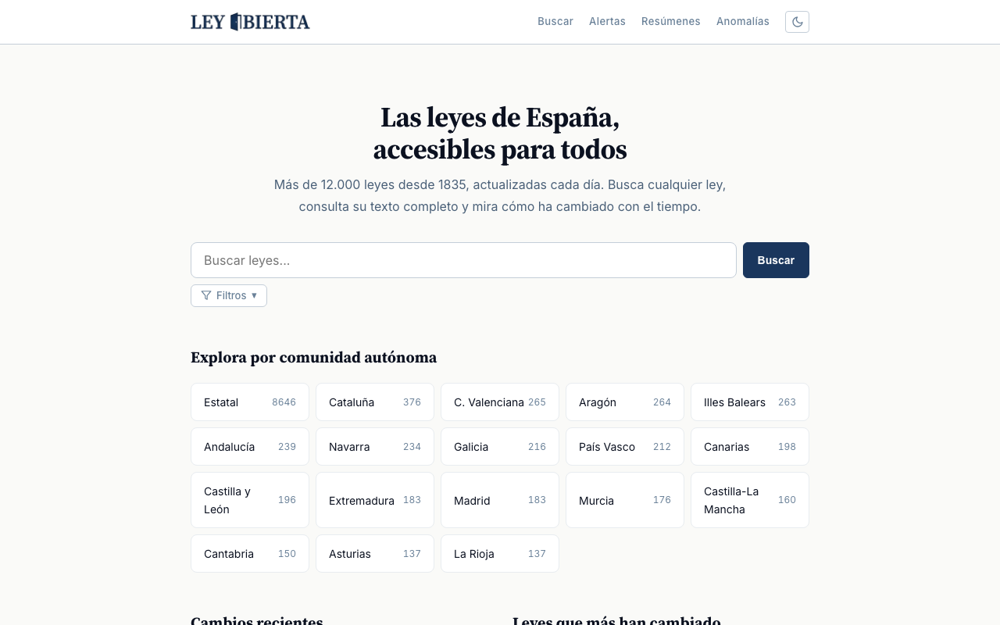
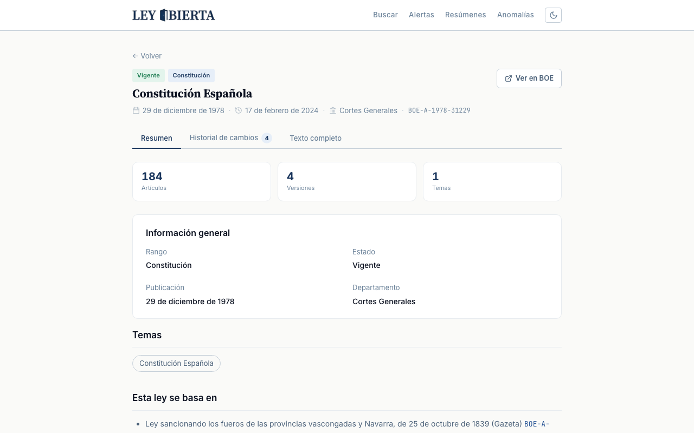

# Ley Abierta

**Open legislation for everyone.** Every law is a Markdown file. Every reform is a Git commit.

Ley Abierta downloads official legislation, turns it into version-controlled, machine-readable data, and makes it available through a website and open API so anyone can search, compare versions, and understand how laws change over time.

> 🇪🇸 [Version en espanol mas abajo](#ley-abierta-es)

## Why

Laws change constantly, but tracking those changes is nearly impossible. Official sources publish consolidated texts with no way to compare versions. Commercial services like Westlaw or Aranzadi charge hundreds of euros per month for version history.

Laws are public domain. Access to them should be free.

## Screenshots

| Homepage | Law detail |
|----------|------------|
|  |  |

**[Try it live at leyabierta.es](https://leyabierta.es)**

## How it works

1. **Downloads** legislation from official sources (BOE for Spain)
2. **Transforms** official XML into structured Markdown with YAML metadata
3. **Versions** each reform as a Git commit with the official publication date
4. **Serves** the data through a REST API and a public website

## Repos

| Repo | Content |
|------|---------|
| **leyabierta** (this) | Source code: pipeline, API, web |
| **[leyes](https://github.com/leyabierta/leyes)** | Spanish legislation as Markdown + Git history |

The leyes repo is generated automatically by the pipeline. Each file is a law, each commit is a reform:

```bash
# Clone Spanish legislation
git clone https://github.com/leyabierta/leyes.git

# Read the Constitution
cat es/BOE-A-1978-31229.md

# When did a law change?
git log --oneline -- es/BOE-A-1978-31229.md

# See the exact diff of a reform
git show <commit-sha> -- es/BOE-A-1978-31229.md
```

### ELI structure

Folders follow the [ELI](https://eur-lex.europa.eu/eli-register/about.html) (European Legislation Identifier) standard:

```
leyes/
├── es/                    ← State-level legislation (8,636 laws)
│   ├── BOE-A-1978-31229.md   # Spanish Constitution
│   ├── BOE-A-1995-25444.md   # Criminal Code
│   └── ...
├── es-pv/                 ← Basque Country (209 laws)
├── es-ct/                 ← Catalonia (356 laws)
├── es-an/                 ← Andalusia (181 laws)
└── ...                    ← 17 autonomous communities
```

One folder = one jurisdiction. One file = one law. Metadata goes in YAML frontmatter:

```yaml
---
titulo: "Ley 11/2019, de 20 de diciembre, de Cooperativas de Euskadi"
identificador: "BOE-A-2020-615"
pais: "es"
jurisdiccion: "es-pv"
rango: "ley"
fecha_publicacion: "2020-01-16"
ultima_actualizacion: "2025-01-14"
estado: "vigente"
departamento: "Comunidad Autonoma del Pais Vasco"
fuente: "https://www.boe.es/eli/es-pv/l/2019/12/20/11"
articulos: 164
reformas:
  - fecha: "2020-01-16"
    fuente: "BOE-A-2020-615"
  - fecha: "2025-01-14"
    fuente: "BOE-A-2024-26853"
materias:
  - "Cooperativas"
  - "Comunidad Autonoma del Pais Vasco"
---
```

Each file is self-contained: frontmatter includes metadata, reform history, subject categories, and cross-references. The body is the full legal text in Markdown.

### Pre-1970 dates

Git doesn't support dates before January 1, 1970 (Unix epoch). This affects ~334 laws published between 1835 and 1969, including the Civil Code (1889) and the Mortgage Law (1946).

For these laws, the commit date shows as `1970-01-02` (the minimum allowed), but the real publication date is in the YAML frontmatter (`fecha_publicacion`) and in the `Source-Date` commit trailer. The website and API use the real date.

## Spain in numbers

| | |
|------|-------|
| Consolidated laws | 12,235 |
| State-level | 8,646 |
| Autonomous communities | 3,589 |
| Jurisdictions | 18 (state + 17 regions) |
| Oldest law | 1835 |
| Most reformed | General Social Security Law (107 reforms) |
| Active | 9,876 |
| Repealed | 2,355 |

## Daily updates

A daily pipeline (GitHub Actions) keeps legislation up to date:

- **Monday to Saturday (06:00 UTC):** Checks for new laws published in the BOE
- **Sundays (04:00 UTC):** Full sync of all laws to detect reforms to existing legislation

The pipeline is idempotent: reprocessing a law never creates duplicate commits.

## Countries

| Country | Source | Laws | Status |
|---------|--------|------|--------|
| Spain | [BOE](https://www.boe.es/) | 12,235 | Deployed |
| France | [Legifrance](https://www.legifrance.gouv.fr/) | — | Planned |
| Germany | [BGBL](https://www.bgbl.de/) | — | Planned |
| Portugal | [DRE](https://dre.pt/) | — | Planned |

## Stack

TypeScript + Bun monorepo:

- **pipeline** — download, parse, transform, and generate commits
- **api** — REST API (Elysia) with SQLite + FTS5 for full-text search
- **web** — public website (Astro, 100% static) with dark mode, SEO, diff viewer

## Development

```bash
bun install
bun test
bun run check

# Pipeline
bun run pipeline bootstrap --country es
bun run ingest
bun run ingest-analisis

# Servers
bun run api   # http://localhost:3000
bun run web   # http://localhost:4321
```

## Contributing

Ley Abierta is an open project. You can help by:

- Reporting errors in a law's text (include the law, article, and official source)
- Adding support for a new country
- Improving the web or API
- Suggesting features

## Acknowledgments

Inspired by:
- [ALEF](https://www.lavozdegalicia.es/noticia/reto-digital/ocio/2024/01/30/leyexe/00031706632270589450575.htm) — Agile Law Execution Factory, the Dutch Tax Authority's formal language for executable law
- [Legalize](https://github.com/legalize-dev) — pioneering legislation-as-code project

## License

Legislative content: public domain (sourced from official publications).
Code and tooling: [MIT](LICENSE).

---

<a id="ley-abierta-es"></a>

# Ley Abierta 🇪🇸

**Legislación abierta para todos.** Cada ley es un archivo Markdown. Cada reforma es un commit de Git.

Ley Abierta descarga legislación oficial, la convierte en datos versionados y legibles por máquina, y los pone a disposición de cualquier ciudadano a través de una web y una API abierta.

## Por qué

Las leyes cambian constantemente, pero seguir esos cambios es casi imposible. Las fuentes oficiales publican textos consolidados sin forma de comparar versiones. Los servicios comerciales cobran cientos de euros al mes por historial de versiones.

Las leyes son de todos. Su evolución debería ser visible, accesible y gratuita.

## Cómo funciona

1. **Descarga** legislación desde fuentes oficiales (BOE para España)
2. **Transforma** el XML oficial en Markdown estructurado con metadatos YAML
3. **Versiona** cada reforma como un commit de Git con la fecha oficial de publicación
4. **Expone** los datos a través de una API REST y una web pública

## Repos

| Repo | Contenido |
|------|-----------|
| **leyabierta** (este) | Código fuente: pipeline, API, web |
| **[leyes](https://github.com/leyabierta/leyes)** | Legislación española en Markdown + Git history |

El repo de leyes es generado automáticamente por el pipeline. Cada archivo es una norma, cada commit es una reforma:

```bash
# Clonar la legislación española
git clone https://github.com/leyabierta/leyes.git

# Ver la Constitución
cat es/BOE-A-1978-31229.md

# Ver la Ley de Cooperativas de Euskadi
cat es-pv/BOE-A-2020-615.md

# ¿Cuándo cambió una ley?
git log --oneline -- es/BOE-A-1978-31229.md

# Ver el diff exacto de una reforma
git show <commit-sha> -- es/BOE-A-1978-31229.md
```

### Estructura ELI

Las carpetas siguen el estándar [ELI](https://eur-lex.europa.eu/eli-register/about.html) (European Legislation Identifier):

```
leyes/
├── es/                    ← Legislación estatal (8,636 normas)
│   ├── BOE-A-1978-31229.md   # Constitución Española
│   ├── BOE-A-1995-25444.md   # Código Penal
│   └── ...
├── es-pv/                 ← País Vasco (209 normas)
│   ├── BOE-A-2020-615.md     # Ley de Cooperativas de Euskadi
│   └── ...
├── es-ct/                 ← Cataluña (356 normas)
├── es-an/                 ← Andalucía (181 normas)
└── ...                    ← 17 comunidades autónomas
```

Una carpeta = una jurisdicción. Un archivo = una norma. El rango y los metadatos van en el frontmatter YAML.

### Fechas anteriores a 1970

Git no soporta fechas anteriores al 1 de enero de 1970 (Unix epoch). Esto afecta a unas 334 leyes publicadas entre 1835 y 1969, incluyendo el Código Civil (1889), la Ley Hipotecaria (1946) y otras normas históricas que siguen vigentes.

Para estas normas:
- La **fecha del commit** en git aparece como `1970-01-02` (el mínimo permitido)
- La **fecha real de publicación** está en el frontmatter YAML (`fecha_publicacion`) y en el trailer `Source-Date` de cada commit
- La web y la API usan la fecha real, no la del commit

## España en números

| Dato | Valor |
|------|-------|
| Normas consolidadas | 12,235 |
| Estatales | 8,646 |
| Autonómicas | 3,589 |
| Jurisdicciones | 18 (estatal + 17 CCAA) |
| Norma más antigua | 1835 |
| Norma más reformada | Ley General Seguridad Social (107 reformas) |
| Vigentes | 9,876 |
| Derogadas | 2,355 |

## Actualizaciones automáticas

Un pipeline diario (GitHub Actions) mantiene las leyes actualizadas:

- **Lunes a sábado (06:00 UTC):** Busca normas nuevas en el BOE y las añade al repo
- **Domingos (04:00 UTC):** Re-sincroniza todas las normas para detectar reformas a leyes existentes

El pipeline es idempotente: re-procesar una norma no duplica commits.

## Países

| País | Fuente | Normas | Estado |
|------|--------|--------|--------|
| España | [BOE](https://www.boe.es/) | 12,235 | Desplegado |
| Francia | [Legifrance](https://www.legifrance.gouv.fr/) | — | Planeado |
| Alemania | [BGBL](https://www.bgbl.de/) | — | Planeado |
| Portugal | [DRE](https://dre.pt/) | — | Planeado |

## Stack

TypeScript + Bun. Monorepo con tres paquetes:

- **pipeline** — descarga, parsea, transforma y genera commits
- **api** — API REST (Elysia) con SQLite + FTS5 para búsqueda full-text
- **web** — interfaz pública (Astro, 100% estática) con dark mode, SEO, diff viewer

## Desarrollo

```bash
bun install
bun test
bun run check

# Pipeline
bun run pipeline bootstrap --country es
bun run ingest
bun run ingest-analisis

# Servidores
bun run api   # http://localhost:3000
bun run web   # http://localhost:4321
```

## Contribuir

Ley Abierta es un proyecto abierto. Si quieres ayudar:

- Reporta errores en el texto de una ley (incluye la ley, artículo y fuente oficial)
- Añade soporte para un nuevo país
- Mejora la web o la API
- Sugiere funcionalidades

## Agradecimientos

Inspirado por:
- [ALEF](https://www.lavozdegalicia.es/noticia/reto-digital/ocio/2024/01/30/leyexe/00031706632270589450575.htm) — Agile Law Execution Factory, lenguaje formal de la Autoridad Fiscal holandesa para ley ejecutable
- [Legalize](https://github.com/legalize-dev) — proyecto pionero de legislación como código

## Licencia

Contenido legislativo: dominio público (procedente de publicaciones oficiales).
Código y herramientas: [MIT](LICENSE).
